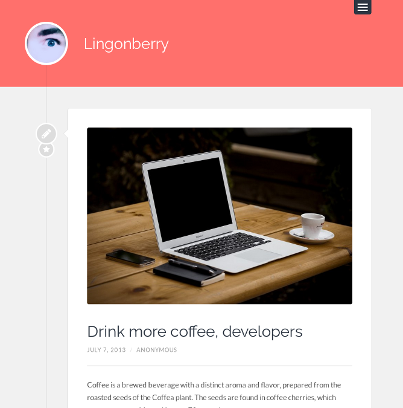

# Kirby Lingonberry
  

A Kirby port of the [Wordpress](https://wordpress.org) theme '[Lingonberry](https://wordpress.org/themes/lingonberry)'.

**Table of contents**
- [1. Getting started](#getting-started)
- [2. Credits / License](#credits--license)

## Getting started
Use one of the following methods to start blogging with `kirby-lingonberry`:

1. [Clone](https://github.com/S1SYPHOS/kirby-lingonberry.git) or [download](https://github.com/S1SYPHOS/kirby-lingonberry/archive/master.zip) this repository.
2. Unzip / Upload the folder to your site's `root`.

### Configuration
Detailed instructions coming soon!

## Credits / License
This is a [port](https://en.wikipedia.org/wiki/Porting) of the Wordpress theme 'Lingonberry', which was originally developed by [Anders Norén](http://andersnoren.se). `kirby-lingonberry` is licensed under the [GPL v2](LICENSE), but **using Kirby in production** requires you to [buy a license](https://getkirby.com/buy). Are you ready for the [next step](https://getkirby.com/next)?

**Used Kirby extensions:**
- [Images](https://github.com/medienbaecker/kirby-images)
- [Quickselect](https://github.com/medienbaecker/kirby-quickselect)
- [Multiselect](https://github.com/distantnative/field-multiselect)
- [Color picker](https://github.com/ian-cox/Kirby-Color-Picker)

## Special Thanks
I'd like to thank everybody that's making great software - you people are awesome. Also I'm always thankful for feedback and bug reports :)

